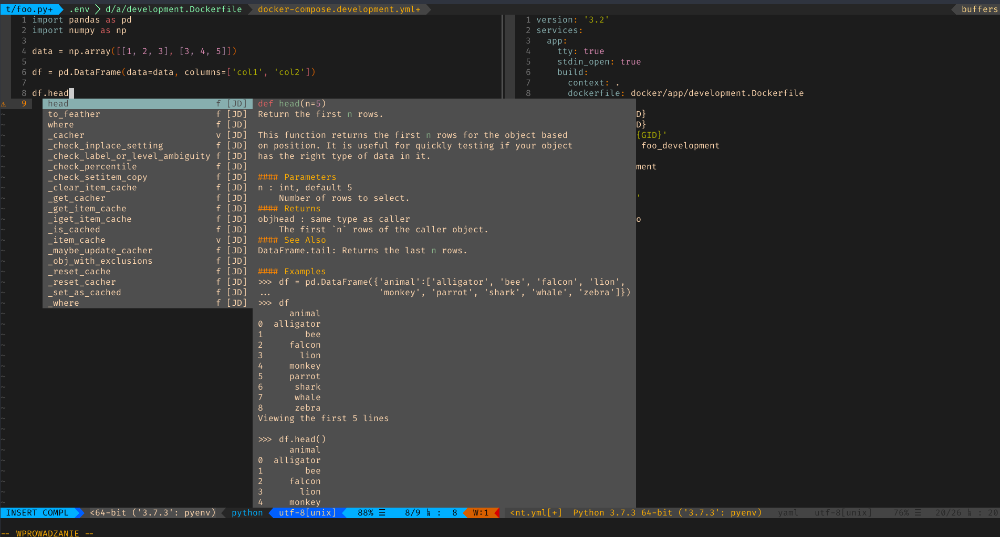
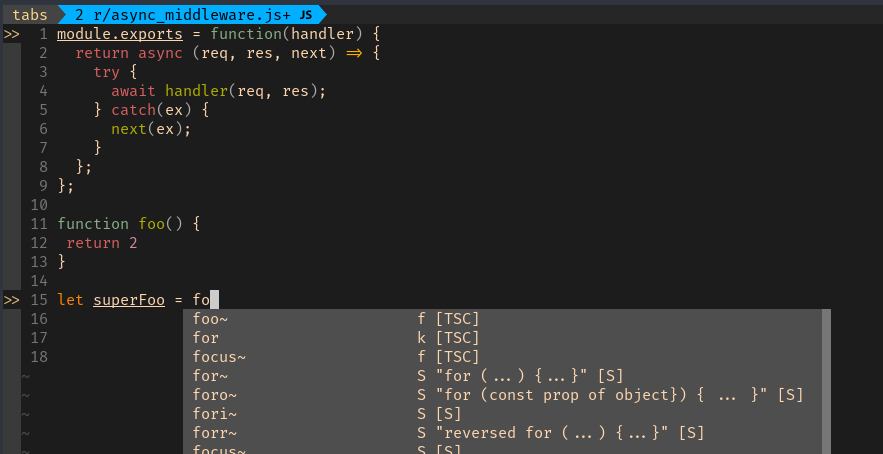

# Neovim configuration

Configuration for [neovim](https://neovim.io/).

## Table of contents

1. [Dependencies](#dependencies)
    1. [Linters and language servers](#linters-and-language-servers)
    2. [Fonts](#fonts)
    3. [Other](#other)
2. [Screenshots](#screenshots)
3. [Note](#note)

## Dependencies

List of programs/fonts/languages which should be installed to use all features of the configuration. Rest of dependencies you can install via `:PlugInstall`.

### Linters and language servers

- Bash language server
  - More info: [Repository](https://github.com/mads-hartmann/bash-language-server)
  - Install: `npm i -g bash-language-server`
- Ruby language server
  - More info: [Repository](https://github.com/castwide/solargraph)
  - Install: `gem install solargraph`
- Docker language server
  - More info: [Repository](https://github.com/rcjsuen/dockerfile-language-server-nodejs)
  - Install: `npm install -g dockerfile-language-server-nodejs`
- Viml linter
  - More info: [Repository](https://github.com/Kuniwak/vint)
  - Install: `pip install vim-vint`
- Coc extensions
  - [coc-json](https://github.com/neoclide/coc-json) `CocInstall coc-json`
  - [coc-solagraph](https://github.com/neoclide/coc-solagraph) `CocInstall coc-solagraph`
  - [coc-lists](https://github.com/neoclide/coc-lists) `CocInstall coc-lists`
  - [coc-snippets](https://github.com/neoclide/coc-snippets) `CocInstall coc-snippets`
  - [coc-highlight](https://github.com/neoclide/coc-highlight) `CocInstall coc-highlight`
  - [coc-marketplace](https://github.com/fannheyward/coc-marketplace) `CocInstall coc-marketplace`
  - [coc-vimlsp](https://github.com/iamcco/coc-vimlsp) `CocInstall coc-vimlsp`
  - [coc-tsserver](https://github.com/neoclide/coc-tsserver) `CocInstall coc-tsserver`
  - [coc-sql](https://github.com/fannheyward/coc-sql) `CocInstall coc-sql`
  - [coc-prettier](https://github.com/neoclide/coc-prettier) `CocInstall coc-prettier`

### Fonts
The font which I use is [FiraCode](https://github.com/ryanoasis/nerd-fonts/tree/master/patched-fonts/FiraCode).
To install it visit [nerd-fonts](https://github.com/ryanoasis/nerd-fonts#font-installation), clone the repository and
use `install.sh` to install the desired font. After that, change the font in your terminal. For example ([kitty terminal](https://github.com/kovidgoyal/kitty)):
```
# ~/.config/kitty/kitty.conf

font_family Fira Code Regular Nerd Font Complete
bold_font auto
italic_font auto
bold_italic_font auto
font_size 12
```

### Other
- [Docker](https://www.docker.com/)
- [Python](https://www.python.org/)
- [Ruby](https://www.ruby-lang.org/en/)
- [Node](https://nodejs.org/en/)

To see configuration for bash, terminal or i3 which I use, visit [Click](https://github.com/pjezusek/dotfiles-archlinux).

# Screenshots
Screenshots made with [Deepin Screenshot](https://www.deepin.org/en/original/deepin-screenshot/)




# Note
Feel free to ask about details of the configuration. I will answer asap.
